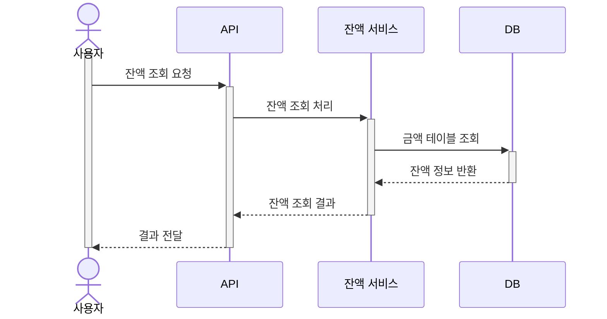
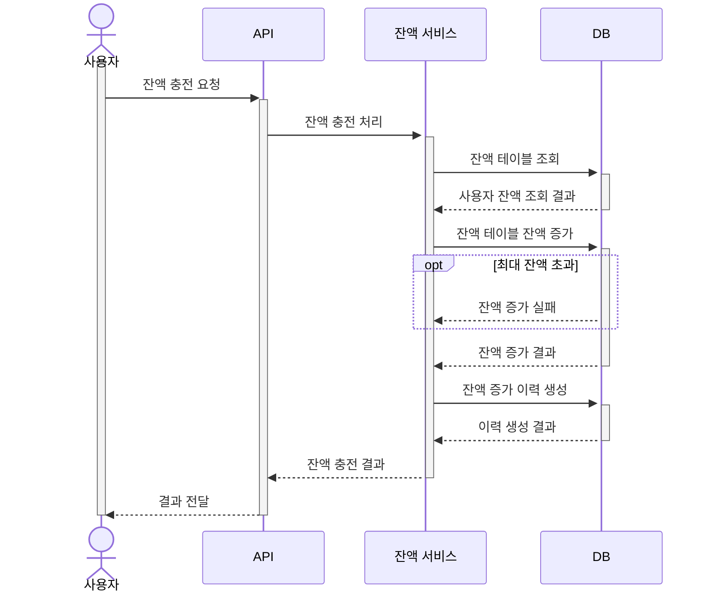
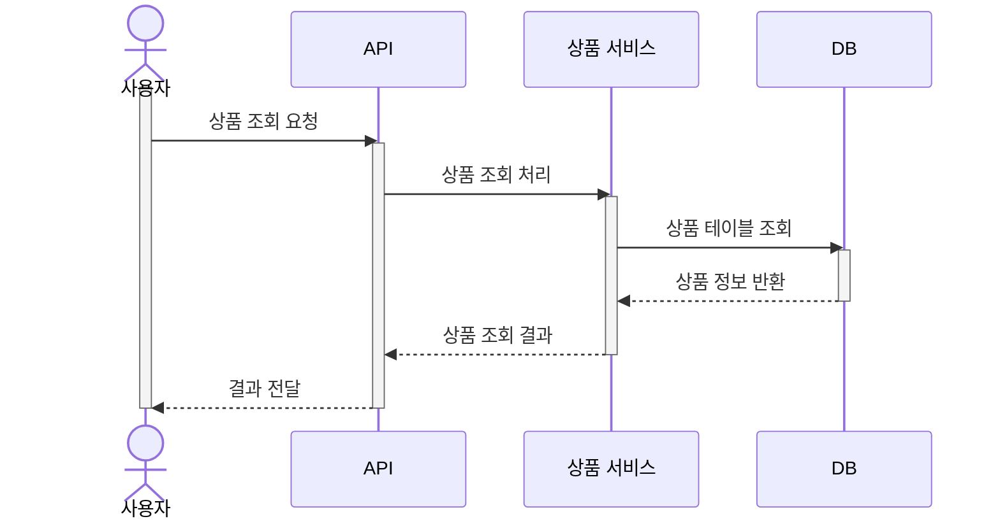
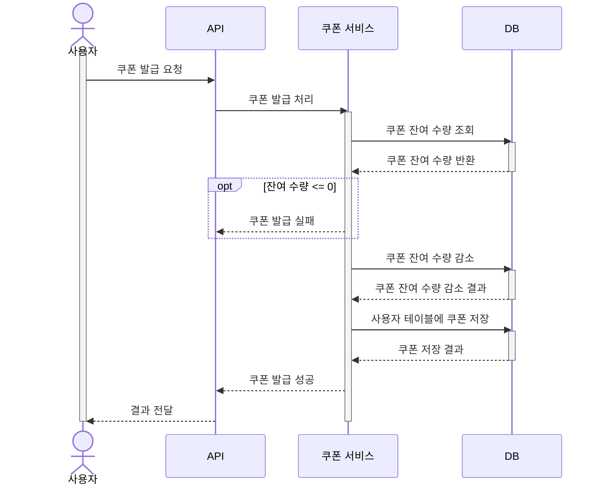
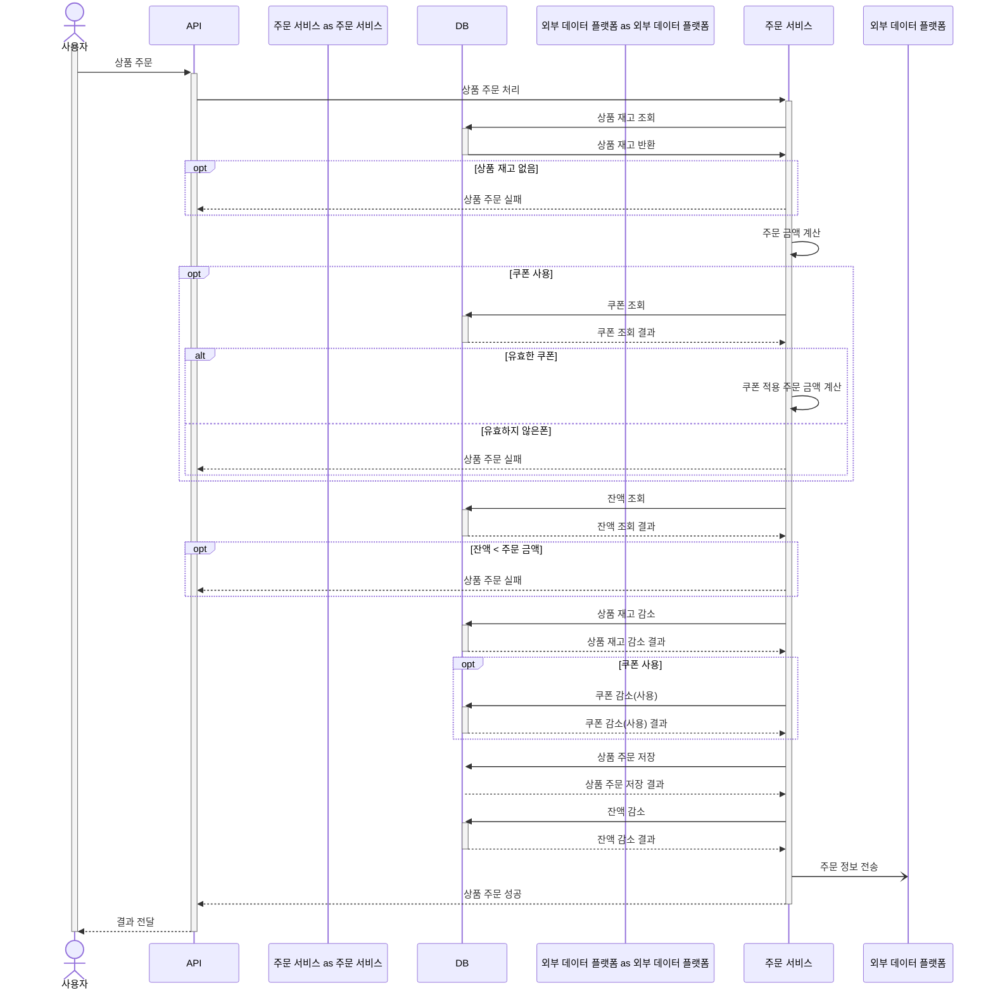
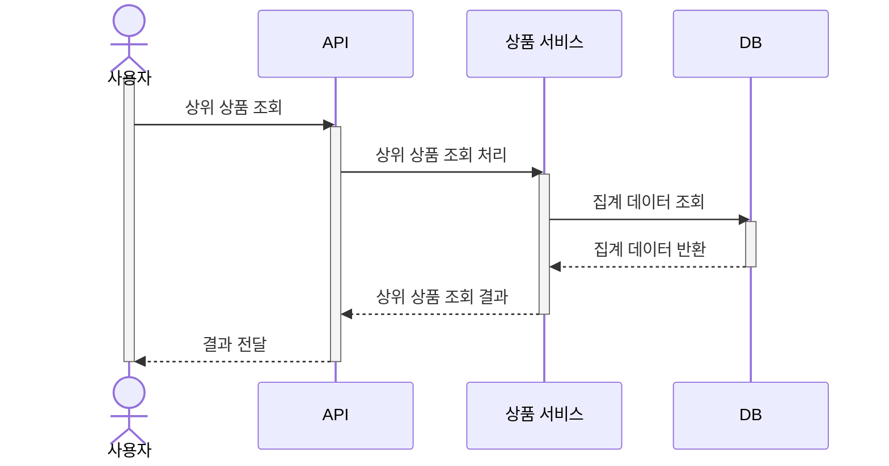
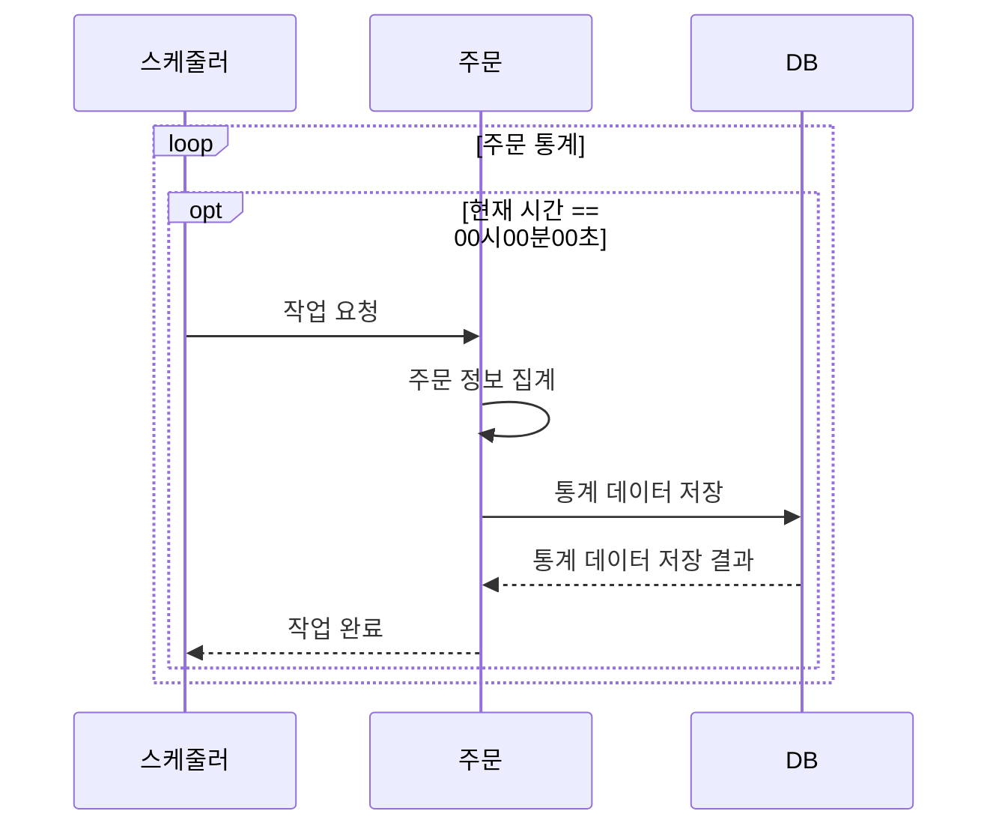

# E-커머스 시퀀스 다이어그램

- [잔액 조회](#잔액-조회)
- [잔액 충전](#잔액-충전)
- [상품 조회](#상품-조회)
- [선착순 쿠폰 발급](#선착순-쿠폰)
- [주문/결제](#주문결제)
- [상위 상품 조회](#상위-상품-조회)

## 잔액 조회

## 잔액 충전

## 상품 조회

## 선착순 쿠폰

## 주문/결제

## 상위 상품 조회

## 상위 상품 집계
