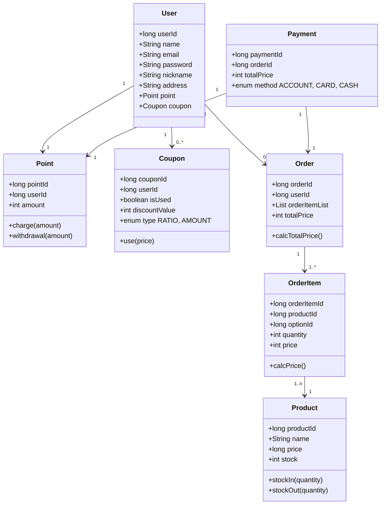

```mermaid
classDiagram
    class User {
        +long userId
        +String name
        +String email
        +String password
        +String nickname
        +String address
        +Point point
        +Coupon coupon
    }
    class Product {
        +long productId
        +String name
        +long price
        +int stock
        +stockIn(quantity)
        +stockOut(quantity)
    }
    class Point {
        +long pointId
        +long userId
        +int amount
        +charge(amount)
        +withdrawal(amount)
    }
    class Coupon {
        +long couponId
        +long userId
        +boolean isUsed
        +int discountValue
        +enum type RATIO, AMOUNT
        +use(price)
    }
    class Order {
        +long orderId
        +long userId
        +List<OrderItem> orderItemList
        +int totalPrice
        +calcTotalPrice()
    }
    class OrderItem {
        +long orderItemId
        +long productId
        +long optionId
        +int quantity
        +int price
        +calcPrice()
    }
    class Payment {
        +long paymentId
        +long orderId
        +int totalPrice
        +enum method ACCOUNT, CARD, CASH
    }
    User "1" --> "0..*" Order
    User "1" --> "1" Point
    Order "1" --> "1..*" OrderItem
    User "1" --> "0..*" Coupon
    Payment "1" --> "1" Order
    Payment "1" --> "1" Point
    OrderItem "1..n" --> "1" Product
```