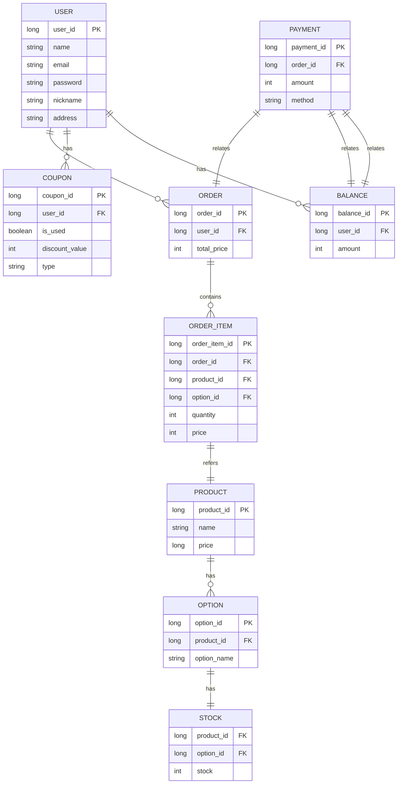

```mermaid
erDiagram
    USER {
        long user_id PK
        string name
        string email
        string password
        string nickname
        string address
    }

    PRODUCT {
        long product_id PK
        string name
        long price
    }

    OPTION {
        long option_id PK
        long product_id FK
        string option_name
    }

    BALANCE {
        long balance_id PK
        long user_id FK
        int amount
    }

    STOCK {
        long product_id FK
        long option_id FK
        int stock
    }

    COUPON {
        long coupon_id PK
        long user_id FK
        boolean is_used
        int discount_value
        string type
    }

    ORDER {
        long order_id PK
        long user_id FK
        int total_price
    }

    ORDER_ITEM {
        long order_item_id PK
        long order_id FK
        long product_id FK
        long option_id FK
        int quantity
        int price
    }

    PAYMENT {
        long payment_id PK
        long order_id FK
        int amount
        string method
    }

    USER ||--o{ ORDER : places
    USER ||--o{ COUPON : has
    USER ||--o{ BALANCE : has
    PRODUCT ||--o{ OPTION : has
    OPTION ||--|| STOCK : has
    ORDER ||--o{ ORDER_ITEM : contains
    ORDER_ITEM ||--|| PRODUCT : refers
    PAYMENT ||--|| ORDER : relates
    PAYMENT ||--|| BALANCE : relates
    PAYMENT ||--|| BALANCE : relates
```